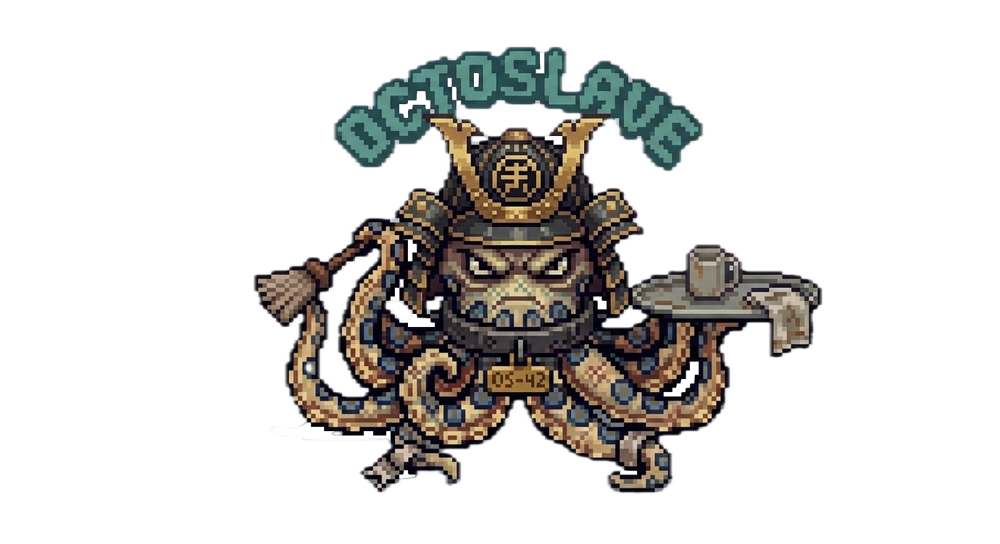

<div align="center">



<h1>OctoSlave</h1>

<p><strong>Autonomous AI research &amp; coding assistant — powered by <a href="https://llm.ai.e-infra.cz">e-INFRA CZ</a> or your own local GPU</strong></p>

[](https://www.python.org)
[](LICENSE)
[](https://llm.ai.e-infra.cz)
[](https://ollama.com)

</div>

---

OctoSlave is a terminal-based autonomous agent built for scientists and engineers.
Give it a task or a research topic — it explores the web, writes and runs code, debugs, evaluates, and iterates until the job is done.

It ships two modes:

- **Interactive agent** — an always-on REPL that can do anything Claude Code can, using academic-grade LLMs
- **Long-research pipeline** (`/long-research`) — a population of 6 specialist agents that conduct rigorous, multi-round research with real data, reproducible code, and a polished HTML deliverable

---

## Contents

- [Features](#features)
- [Installation](#installation)
- [Quick start](#quick-start)
- [Web UI](#web-ui)
- [Interactive TUI](#interactive-tui)
- [Slash commands](#slash-commands)
- [One-shot mode](#one-shot-mode)
- [Long-research pipeline](#long-research-pipeline)
- [Available models](#available-models)
- [Local models (Ollama)](#local-models-ollama)
- [Tools reference](#tools-reference)
- [Configuration](#configuration)
- [Permission modes](#permission-modes)
- [Project structure](#project-structure)
- [License](#license)

---

## Features

<table>
<tr><td>🔁 <strong>Autonomous loop</strong></td><td>Runs up to 80 tool-call iterations end-to-end — no hand-holding required</td></tr>
<tr><td>🌐 <strong>Web research</strong></td><td>DuckDuckGo search + full-page text extraction from any URL or PDF</td></tr>
<tr><td>🖥️ <strong>Shell &amp; filesystem</strong></td><td>Read, write, edit files; run arbitrary shell commands; install packages via uv / pip</td></tr>
<tr><td>📡 <strong>Streaming output</strong></td><td>Reasoning and tool calls appear in real time with a Rich TUI</td></tr>
<tr><td>🔬 <strong>Multi-agent research</strong></td><td>6 specialist roles collaborate across multiple rounds; findings.md updated automatically</td></tr>
<tr><td>📊 <strong>Visual-first results</strong></td><td>Every round produces publication-quality plots; final HTML report with embedded figures</td></tr>
<tr><td>🛡️ <strong>Data integrity</strong></td><td>Synthetic data is forbidden — the pipeline skips unavailable sources and pivots to alternatives</td></tr>
<tr><td>⚡ <strong>GPU-aware</strong></td><td>Hardware probe at startup; CUDA utilisation enforced in all generated code</td></tr>
<tr><td>🏠 <strong>Local mode</strong></td><td>Full functionality via Ollama — no API key needed, complete privacy</td></tr>
<tr><td>💾 <strong>Resumable</strong></td><td>Research runs persist to disk and resume exactly where they left off</td></tr>
<tr><td>🔒 <strong>Permission modes</strong></td><td>Choose between <code>autonomous</code> (default), <code>controlled</code> (ask before all edits), or <code>supervised</code> (ask before file edits only)</td></tr>
</table>

---

## Installation

**Requirements:** Python 3.10+, an [e-INFRA CZ LLM](https://llm.ai.e-infra.cz) API key *(or Ollama for local mode)*

### Step 1 — Install Python (skip if you already have Python 3.10+)

<details>
<summary><strong>Windows</strong></summary>

1. Go to [https://www.python.org/downloads/](https://www.python.org/downloads/) and click **Download Python 3.x.x**.
2. Run the installer. **Important:** tick the box **"Add Python to PATH"** before clicking Install.
3. Open **Command Prompt** (`Win + R` → type `cmd` → Enter) and verify:
   ```
   python --version
   ```
   You should see something like `Python 3.12.3`.

</details>

<details>
<summary><strong>macOS</strong></summary>

Option A — official installer (easiest):
1. Go to [https://www.python.org/downloads/](https://www.python.org/downloads/) and download the macOS package.
2. Run the `.pkg` installer and follow the prompts.

Option B — Homebrew (if you already use it):
```bash
brew install python
```

Verify in **Terminal**:
```bash
python3 --version
```

</details>

<details>
<summary><strong>Linux (Ubuntu / Debian)</strong></summary>

```bash
sudo apt update
sudo apt install python3 python3-pip
python3 --version
```

</details>

> `pip` (the Python package installer) is bundled with Python 3.10+ — you do not need to install it separately. If `pip` is missing for any reason, run `python -m ensurepip --upgrade`.

---

### Step 2 — Get the code

If you have [Git](https://git-scm.com/downloads) installed:

```bash
git clone https://github.com/karatedava/octoslave.git
cd octoslave
```

No Git? Download the ZIP directly from the GitHub page → **Code → Download ZIP**, then unzip and open a terminal inside the folder.

---

### Step 3 — Install OctoSlave

```bash
# CLI only
pip install -e .

# CLI + web UI (recommended)
pip install -e ".[web]"
```

> On macOS/Linux you may need to use `pip3` instead of `pip` if your system has both Python 2 and Python 3. If you see a "permission denied" error, add `--user` to the command: `pip install --user -e ".[web]"`.

> **Recommended:** use [uv](https://github.com/astral-sh/uv) for faster, reproducible installs:
> ```bash
> pip install uv          # install uv once
> uv pip install -e ".[web]"
> ```

### Set your API key

```bash
ots config                        # interactive setup wizard
ots config --api-key sk-YOUR_KEY  # pass key directly
ots config --model qwen3-coder-30b  # set default model
ots config --ollama-url http://remote-host:11434/v1  # remote Ollama
ots config --show                 # print current config (key masked)
export OCTOSLAVE_API_KEY=sk-...   # or set env var for the session
```

Config is saved at `~/.octoslave/config.json`. Environment variables always take precedence.

---

## Quick start

```bash
# Interactive TUI (e-INFRA CZ)
ots

# Interactive TUI (local Ollama)
ots --local

# Web UI (opens browser automatically)
ots web

# One-shot task
ots run "build a Flask REST API for a todo app"

# Research — 3 autonomous rounds
ots
◆ /long-research "calibration methods for large language models" --rounds 3
```

---

## Web UI

OctoSlave includes a browser-based GUI with the same full functionality as the terminal — ideal if you prefer not to use the CLI.

```bash
# Install web dependencies and launch
pip install -e ".[web]"
ots web                          # opens http://127.0.0.1:7860 in your browser
ots web --port 8080              # custom port
ots web --host 0.0.0.0           # expose on the network
ots web --no-browser             # start server without auto-opening browser
```

The web UI has four tabs:

| Tab | What it does |
|-----|-------------|
| **Chat** | Full conversational agent — streaming responses, tool call inspector, conversation history |
| **Research** | Launch `/long-research` pipeline with live round progress, agent status, and streaming console |
| **Files** | Browse all research outputs — view HTML reports inline, preview plots and markdown |
| **Settings** | Inspect current configuration (API key, model, backend) |

All research outputs (HTML reports, plots, markdown) are accessible directly in the Files tab without leaving the browser.

---

## Interactive TUI

Running `ots` opens the full TUI:

```
  ╭────────────────────────────────────────────────╮
  │                  ██████████                    │
  │               ██████████████                   │
  │              ████████████████                  │
  │            ██████████████████                  │
  │            ████◉███████◉█████                  │
  │            ██████████████████                  │
  │               ████ ▄▄▄▄▄ ████                  │
  │            ◆─◆─◆─◆─◆─◆─◆─◆─◆─                  │ 
  │                █████ ◈ █████                   │  
  │             ╰██╯ ╰██╯ ╰██╯ ╰██╯                │
  │                                                │
  │               OCTOSLAVE                        │
  │  model deepseek-v3.2   dir ~/project           │
  │  /help for commands                            │
  ╰────────────────────────────────────────────────╯

◆ [deepseek-v3.2] _
```

- Type any task in natural language — the agent streams its thinking and tool calls live
- Follow up freely; full conversation context is preserved across turns
- Use `/` commands to control the session (see below)

**Keyboard shortcuts**

| Key | Action |
|-----|--------|
| `↑` / `↓` | Cycle through prompt history |
| `Ctrl+C` | Cancel current generation (history kept) |
| `Ctrl+D` | Exit |
| `Ctrl+L` | Clear terminal screen |

---

## Slash commands

| Command | Description |
|---------|-------------|
| `/model [name]` | Switch model; lists available if no name given |
| `/dir [path]` | Change the active working directory |
| `/profile [name]` | Switch prompt profile (`base` / `simple` / `strict`) |
| `/permission [mode]` | Show or change permission mode (`autonomous` / `controlled` / `supervised`) |
| `/clear` | Clear screen and reset conversation history |
| `/compact` | Summarise history into a compact context block (saves tokens) |
| `/local [model]` | Switch to local Ollama backend |
| `/einfra` | Switch back to e-INFRA CZ backend |
| `/pull model` | Pull a new Ollama model without leaving the session |
| `/long-research TOPIC [flags]` | Launch the multi-agent research pipeline |
| `/help` | Show all commands and flags |
| `/exit` | Quit (also `Ctrl+D`) |

---

## One-shot mode

```bash
ots run "refactor the authentication module" \
  --model qwen3-coder-30b \
  --dir /path/to/project

# Stay interactive after the run completes
ots run "set up a data processing pipeline for CSV files" -i

ots run --help   # full flag reference
```

---

## Long-research pipeline

`/long-research` deploys **6 specialist agents** that collaborate over multiple fully autonomous rounds:

```
╔══════════════════════════════════════════════════════════════╗
║  Round N                                                     ║
╠══════════════════════════════════════════════════════════════╣
║  🔬 Researcher        Fast targeted scout — SOTA, datasets,  ║
║                       verified access status, handoff brief  ║
║     ↓                                                        ║
║  💡 Experiment        Commits to ONE concrete experiment:    ║
║     Designer          pseudocode, data plan, success metric  ║
║     ↓                                                        ║
║  💻 Coder             Implements on real data, GPU-aware,    ║
║                       produces plots + key_results.json      ║
║     ↓                                                        ║
║  🐛 Debugger          Independent verifier — runs code,      ║
║                       checks GPU use, validates numbers       ║
║     ↓                                                        ║
║  ⚖️  Evaluator         Critical scoring vs SOTA; generates   ║
║                       a colour-coded scores bar chart         ║
║     ↓                                                        ║
║  🧠 Orchestrator      Synthesises findings → writes precise  ║
║                       brief for the next round               ║
╚══════════════════════════════════════════════════════════════╝
  ↓  (after all rounds)
  📊 Master Reporter — comprehensive self-contained HTML report
                       with embedded plots, score progression,
                       and collapsible round deep-dives
```

**Data integrity guarantee:** agents are explicitly forbidden from generating synthetic or dummy data.
If a dataset is unavailable the failure is logged, alternatives are searched, and the pipeline pivots — it never fabricates results.

**GPU enforcement:** a hardware probe runs at startup; all generated code is required to use CUDA when available (mixed-precision, correct device placement, peak VRAM logging).

### Usage

```
/long-research TOPIC [--rounds N] [--all MODEL] [--overseer MODEL] [--resume]
```

| Flag | Default | Description |
|------|---------|-------------|
| `--rounds N` | `5` | Maximum number of research rounds |
| `--all MODEL` | *(per-role defaults)* | Use one model for all 6 agents |
| `--overseer MODEL` | `deepseek-v3.2` | Override the orchestrator model only |
| `--resume` | off | Resume an interrupted run (skips agents whose output already exists) |

### Examples

```
/long-research "effect of batch size on transformer generalisation" --rounds 3

/long-research "protein folding accuracy of ESMFold vs AlphaFold2" \
  --rounds 5 \
  --all qwen3-coder-30b \
  --overseer deepseek-v3.2-thinking

/long-research "RAG retrieval strategies for long documents" --resume
```

### Output structure

Each run creates a self-contained directory tree under `research/` in your working directory:

```
research/
├── final_report.html          ← master HTML report — open in browser
├── findings.md                ← cumulative findings updated after each round
├── hw_profile.json            ← detected hardware (CPU, GPU, VRAM)
│
├── round_001/
│   ├── 01_literature.md       ← papers, datasets (with verified access status)
│   ├── 02_experiment.md       ← experiment design, pseudocode, data plan
│   ├── 03_code/
│   │   ├── *.py               ← experiment scripts
│   │   ├── IMPLEMENTATION.md  ← approach, skipped steps, results summary
│   │   └── results/           ← plots (PNG), key_results.json, logs
│   ├── 04_debug_report.md     ← bugs found/fixed, confidence score
│   ├── 05_evaluation.md       ← independent scoring against SOTA
│   ├── 05_scores_chart.png    ← colour-coded evaluation bar chart
│   └── 06_synthesis.md        ← round summary + brief for next round
│
├── round_002/
│   └── ...
```

---

## Available models (e-INFRA CZ)

Run `ots models` to see the live list. Default assignments in the research pipeline:

| Model | Research role | Strengths |
|-------|--------------|-----------|
| `deepseek-v3.2` | Orchestrator, single-agent default | Strong reasoning, synthesis |
| `deepseek-v3.2-thinking` | Evaluator, Experiment Designer | Extended chain-of-thought |
| `qwen3-coder-30b` | Coder, Debugger | Code generation, tool use |
| `qwen3.5-122b` | Researcher | Fast reading, web research |
| `gpt-oss-120b` | Master Reporter | Large context, clean writing |
| `qwen3-coder` | Lightweight coder | Faster, smaller tasks |
| `qwen3-coder-next` | — | Next-gen coder preview |
| `qwen3.5` | Balanced general | Good all-round |
| `kimi-k2.5` | Long-context tasks | Extended context window |
| `mistral-small-4` | — | Mistral Small 4 |
| `llama-4-scout-17b-16e-instruct` | — | Meta Llama 4 |
| `gemma4` | — | Google Gemma 4 |
| `glm-4.7` / `glm-5` | — | Zhipu GLM series |
| `redhatai-scout` | — | Red Hat AI Scout |
| `thinker` / `coder` / `agentic` / `mini` | — | Alias shortcuts |

Switch mid-session: `/model qwen3-coder-30b` or pass `-m MODEL` to any command.

---

## Local models (Ollama)

OctoSlave runs fully offline via [Ollama](https://ollama.com). All functionality — chat, one-shot tasks, and the full research pipeline — works identically with local models.

### Setup

```bash
# 1. Install Ollama
#    macOS:   brew install ollama
#    Linux:   curl -fsSL https://ollama.com/install.sh | sh

# 2. Start the Ollama daemon
ollama serve

# 3. Pull a model (see hardware guide below)
ollama pull llama3.1:8b

# 4. Start OctoSlave in local mode
ots --local
```

### Backend switching

```bash
# In the TUI:
/local                    # switch to Ollama (first pulled model)
/local llama3.1:8b        # switch to a specific model
/pull qwen2.5-coder:14b   # pull a model without leaving the session
/einfra                   # switch back to e-INFRA CZ

# On the command line:
ots --local run "explain this code"
ots models --local        # list pulled Ollama models
```

### Long-research with local models

In local mode, `/long-research` automatically distributes up to **3 pulled models** across the 6 specialist roles by priority tier:

| Tier | Roles | Characteristic needed |
|------|-------|----------------------|
| **A** — model 1 | Orchestrator, Evaluator | Strong reasoning, synthesis |
| **B** — model 2 | Coder, Debugger, Reporter | Code generation, structured output |
| **C** — model 3 | Researcher, Experiment Designer | Document reading, writing |

If you only have 1 or 2 models pulled, tiers collapse automatically.

### Hardware recommendations

<details>
<summary><strong>8 GB VRAM / 16 GB RAM</strong> — minimum viable</summary>

```bash
ollama pull mistral          # 4 GB — fast, general
```
Good for interactive chat and simple coding tasks. Long-research will be slow and capability-limited.
</details>

<details>
<summary><strong>16 GB VRAM / 32 GB RAM</strong> — recommended starter</summary>

```bash
ollama pull llama3.1:8b      # 5 GB — best reasoning at this size
ollama pull qwen2.5-coder    # 4 GB — strong at code
```
Assign: `llama3.1:8b` → Tier A, `qwen2.5-coder` → Tier B.
</details>

<details>
<summary><strong>24 GB VRAM / 48 GB RAM</strong> — comfortable research</summary>

```bash
ollama pull llama3.1:8b        # 5 GB — Tier A
ollama pull qwen2.5-coder:14b  # 9 GB — Tier B
ollama pull mistral             # 4 GB — Tier C
```
This is the sweet spot for autonomous research runs.
</details>

<details>
<summary><strong>48 GB+ VRAM</strong> — full power</summary>

```bash
ollama pull llama3.3:70b       # 40 GB — Tier A
ollama pull qwen2.5-coder:32b  # 20 GB — Tier B
ollama pull qwen2.5:14b        # 9 GB  — Tier C
```
Approaches cloud model quality for most research tasks.
</details>

<details>
<summary><strong>CPU only (no GPU)</strong></summary>

```bash
ollama pull llama3.2:3b        # 2 GB — smallest capable model
ollama pull qwen2.5-coder:3b   # 2 GB — minimal coding capability
```
Usable for simple interactive tasks. Long-research not recommended on CPU only.
</details>

> Run `ots models --local` at any time to see what you have pulled.

---

## Tools reference

| Tool | Description |
|------|-------------|
| `read_file` | Read file contents (offset/limit for large files); PDFs auto-extracted to text |
| `write_file` | Create or fully overwrite a file |
| `edit_file` | Targeted string replacement — safer than rewriting whole files |
| `bash` | Run any shell command: builds, tests, git, data processing, package installs |
| `glob` | Find files by pattern, e.g. `**/*.py` |
| `grep` | Regex search across files with context lines |
| `list_dir` | Directory listing with sizes and modification times |
| `web_search` | DuckDuckGo search → titles, URLs, one-line snippets |
| `web_fetch` | Fetch URL → clean readable text (strips JS/CSS/ads/nav) |

---

## Configuration

### Which backend should I use?

```
Do you have access to e-INFRA CZ? ──yes──▶ use einfra  (best model quality, free for Czech academia)
         │
         no
         │
         ▼
Do you have a GPU (≥8 GB VRAM)?  ──yes──▶ use ollama  (fully local, private, no API key needed)
         │
         no
         │
         ▼
         use ollama on CPU  (interactive tasks only; long-research not recommended)
```

Run `ots config` — the interactive wizard will walk you through each choice.

### Which model should I set as default?

| Goal | Recommended default |
|------|-------------------|
| Best all-round (reasoning + coding) | `deepseek-v3.2` ← **start here** |
| Writing-heavy tasks | `gpt-oss-120b` |
| Code generation focus | `qwen3-coder-30b` |
| Chain-of-thought / hard problems | `deepseek-v3.2-thinking` |
| Fast general purpose | `qwen3.5-122b` |

The default model is only the starting point — switch any time with `/model NAME` inside the TUI.

### What about `base_url` and `ollama_url`?

- **`base_url`** — leave at the default (`https://llm.ai.e-infra.cz/v1`) unless you are self-hosting an OpenAI-compatible API.
- **`ollama_url`** — leave at the default (`http://localhost:11434/v1`) unless Ollama runs on a different machine or port.

### Precedence and environment variables

| Mechanism | Precedence | Notes |
|-----------|-----------|-------|
| Environment variable | **Highest** | Overrides everything |
| `~/.octoslave/config.json` | Medium | Written by `ots config` |
| Built-in default | Lowest | `deepseek-v3.2`, e-INFRA CZ endpoint |

| Variable | Description |
|----------|-------------|
| `OCTOSLAVE_API_KEY` | e-INFRA CZ API key |
| `OCTOSLAVE_BASE_URL` | API base URL (default: `https://llm.ai.e-infra.cz/v1`) |
| `OCTOSLAVE_MODEL` | Default model override |
| `OCTOSLAVE_BACKEND` | `einfra` (default) or `ollama` |
| `OCTOSLAVE_OLLAMA_URL` | Ollama base URL (default: `http://localhost:11434/v1`) |
| `OCTOSLAVE_PERMISSION_MODE` | `autonomous` (default), `controlled`, or `supervised` |

```bash
ots config          # guided interactive setup
ots config --show   # print current config (key masked)
```

### Permission Modes

OctoSlave supports three permission modes that control how the agent interacts with your system:

- **`autonomous`** (default) — The agent works without asking for permission. Best for trusted workflows and automated tasks.
- **`controlled`** — The agent asks for permission before making any changes (file edits, writes, or command execution). Best for production code or when you want full oversight.
- **`supervised`** — The agent asks for permission before file operations (read/write/edit) but runs shell commands automatically. Ideal when you want oversight on file changes but don't want to approve every test/run command.

Set the mode:

```bash
# Via CLI flag
ots --permission-mode supervised
ots run "edit files" --permission-mode supervised

# Via environment variable
export OCTOSLAVE_PERMISSION_MODE=supervised

# In interactive mode
/permission supervised    # switch to supervised mode
/permission controlled    # switch to controlled mode
/permission autonomous    # switch to autonomous mode
/permission               # show current mode
```

When in controlled or supervised mode, you'll see a prompt before modifying actions:

```
┌────── Controlled Mode ──────┐     ┌────── Supervised Mode ───────┐
│  ⚠ Permission Required      │     │  ⚠ Permission Required       │
│  ✏️  write_file             │     │  🔧 edit_file                │
│  OctoSlave wants to:        │     │  OctoSlave wants to:         │
│  create/overwrite file:     │     │  edit file: src/main.py      │
│  src/main.py                │     │                              │
└─────────────────────────────┘     └──────────────────────────────┘
Allow? (y)/n                            Allow? (y)/n
```

In **supervised** mode, shell commands (`bash`) are executed automatically without prompting, while file operations still require approval.

See [PERMISSION_MODE.md](docs/PERMISSION_MODE.md) for full documentation.

---

## Project structure

```
octoslave/
├── assets/
│   └── logo.png              ← project logo (pixel-art octopus)
├── docs/
│   ├── PERMISSION_MODE.md    ← permission mode documentation
│   └── PROMPT_PROFILES.md    ← prompt profile documentation
├── octoslave/
│   ├── agent.py              ← core agent loop, system prompt, context management
│   ├── config.py             ← config load/save, Ollama helpers, model list
│   ├── display.py            ← Rich TUI + web event bridge (thread-safe emit system)
│   ├── main.py               ← Click CLI, interactive REPL, slash-command handler
│   ├── prompt_profiles/      ← system prompt profiles (base, simple, strict)
│   ├── research.py           ← multi-agent long-research pipeline
│   ├── tools.py              ← all tool definitions and implementations
│   └── web/
│       ├── app.py            ← FastAPI backend: WebSocket handler, file serving
│       └── static/
│           ├── index.html    ← single-page web UI (Chat / Research / Files / Settings)
│           ├── css/
│           │   └── styles.css
│           └── js/
│               ├── app.js        ← main application logic
│               ├── components.js ← UI components (history, file tree, chat helpers)
│               ├── slash-commands.js ← web slash command handler
│               ├── utils.js      ← shared utilities (markdown, escaping)
│               └── websocket.js  ← WebSocket management and reconnection
├── run_research.py           ← CLI helper: run long-research without the TUI
└── pyproject.toml
```

---

## License

MIT — see [LICENSE](LICENSE).

<div align="center">
<br/>

<br/>
<sub>Built for researchers who demand real results.</sub>
</div>
