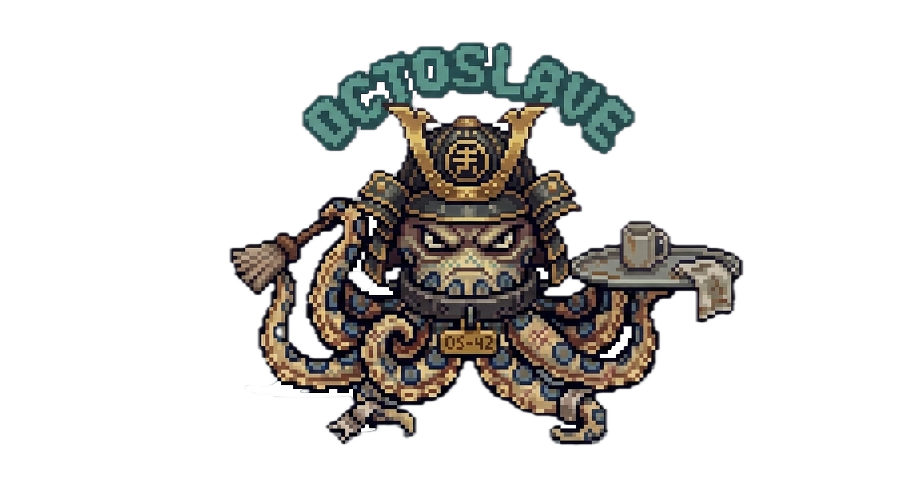

<div align="center">



<h1>OctoSlave</h1>
<a href="https://octoslave.karamazov.website">octoslave.karamazov.website</a>

<p><strong>Autonomous AI research &amp; coding assistant — powered by <a href="https://llm.ai.e-infra.cz">e-INFRA CZ</a>, <a href="https://build.nvidia.com">NVIDIA NIM</a>, or your own local GPU</strong></p>

[](https://www.python.org)
[](LICENSE)
[](https://llm.ai.e-infra.cz)
[](https://build.nvidia.com)
[](https://ollama.com)

</div>

---

OctoSlave is an autonomous agent for scientists and engineers. Give it a task or a research
topic — it explores the web, writes and runs code, debugs, evaluates, and iterates until the
job is done. It runs on cloud models (e-INFRA CZ / NVIDIA NIM) or fully offline via Ollama.

**Modes**

- **Interactive agent** (`ots`) — chat-style assistant for whole projects or single tasks
- **One-shot** (`ots run "..."`) — run a task and exit, or stay interactive with `-i`
- **Parallel agents** (`--parallel N`) — N agents on one task; a Judge / vote / Merger picks the result
- **Autonomous Lab** (`/long-research`, or the web UI at `/lab`) — a Director assembles a custom team of specialists for your problem, a Critic vets the plan, and they research/build over multiple rounds with live human steering → self-contained HTML report
- **Vault improve** (`ots vault-improve`) — note-by-note improvement of an Obsidian / markdown vault
- **Batch** (`ots batch tasks.txt`) — run a list of tasks with resume support

---

## Contents

- [Installation](#installation)
- [Quick start](#quick-start)
- [Highlights](#highlights)
- [Commands](#commands)
- [Backends and models](#backends-and-models)
- [Modes in depth](#modes-in-depth)
- [MCP — custom tools](#mcp--custom-tools)
- [Tools](#tools)
- [Configuration](#configuration)
- [Documentation](#documentation)
- [License](#license)

---

## Installation

**Requirements:** Python 3.10+ and an [e-INFRA CZ](https://llm.ai.e-infra.cz) or
[NVIDIA NIM](https://build.nvidia.com) API key — *or* [Ollama](https://ollama.com) for fully local mode.

### Download installer — no Python required

Each package bundles Python and all dependencies, and launches a setup wizard on first run.

| Platform | Download |
|----------|----------|
| **macOS** | [OctoSlave-macOS.dmg](https://github.com/karatedava/octoslave/releases/latest/download/OctoSlave-macOS.dmg) |
| **Windows** | [OctoSlave-Windows-Installer.exe](https://github.com/karatedava/octoslave/releases/latest/download/OctoSlave-Windows-Installer.exe) |
| **Linux** | [OctoSlave-x86_64.AppImage](https://github.com/karatedava/octoslave/releases/latest/download/OctoSlave-x86_64.AppImage) |

### From source

```bash
# pipx (isolated, recommended)
pipx install "git+https://github.com/karatedava/octoslave.git#egg=octoslave[all]"

# pip / uv
git clone https://github.com/karatedava/octoslave.git && cd octoslave
pip install -e ".[all]"          # or: uv pip install -e ".[all]"

# one-shot installer (macOS / Linux) — picks Python, sets up pipx
bash scripts/install.sh
```

The Lab web UI ships **prebuilt** (in `octoslave/web/lab_static/`), so no Node.js is needed to
install or run. Only if you modify the frontend (`frontend/`) do you need to rebuild it:
`npm ci --prefix frontend && npm run build --prefix frontend` (Node 18+).

### Configure your API key

```bash
ots config                                # interactive wizard (einfra / nim / ollama)
ots config --api-key sk-YOUR_KEY          # e-INFRA CZ key
ots config --nim-api-key nvapi-YOUR_KEY   # NVIDIA NIM key
ots config --show                         # print current config (keys masked)
```

Config is saved at `~/.octoslave/config.json`; environment variables always take precedence
(`OCTOSLAVE_API_KEY`, `OCTOSLAVE_NIM_API_KEY`). See [docs/USAGE.md](docs/USAGE.md) for the full
install reference, including the optional [`codag`](https://codag.ai) helper that powers `compress_log`.

---

## Quick start

```bash
ots                                            # interactive TUI (default backend)
ots run "build a todo API"                     # one-shot task, then exit
ots improved                                   # Improved TUI — a unified model council (see below)
ots improved run "analyse this dataset"        # one-shot through the council
ots improved run "hard task" --ultra           # Ultra — multi-model debate (strongest)
ots --local                                    # local Ollama
ots --nim                                       # NVIDIA NIM
ots web                                          # browser UI at http://127.0.0.1:7860 (Standard · Improved · Ultra selector)
ots run "build a Flask REST API for a todo app"
ots run "summarise this paper" -i                # one-shot, then stay interactive

ots run "refactor the auth module" --parallel 3  # 3 agents, Judge picks the winner

# Autonomous Lab — a self-organizing team. Open the web UI and go to /lab,
# or launch from the TUI:
ots
◆ /long-research "calibration methods for large language models" --rounds 3
```

> The **Lab** web UI (`ots web` → `http://127.0.0.1:7860/lab`) is the richest way to
> run it: watch the team roster, live plan, and per-agent activity; open produced
> files in the browser; and inject guidance at any time.

---

## Highlights

| | |
|---|---|
| 🐙 **Improved mode** | A unified model council — Thinker · Worker · Verifier behind one agent (`ots improved`) |
| ⚡ **Ultra mode** | Deeper tier — a diverse panel debates the plan & completion, synthesized into one (`ots improved --ultra`) |
| 🔁 **Autonomous loop** | Runs many tool-call iterations end-to-end — no hand-holding |
| 🧠 **Upfront planning** | Writes a numbered execution plan before touching files |
| ✅ **Self-verification** | Optional DONE / PARTIAL / FAILED grade after each task (`--verify`) |
| 💾 **Project memory** | Prior outcomes & insights persisted per-project in `.octo/memory.md`, injected on the next run in that folder |
| 📦 **Smart compaction** | On overflow, oldest turns are summarised (not dropped); errors survive |
| 🐙 **Parallel agents** | N agents on one task; Judge / vote / Merger picks the winner |
| 🔬 **Autonomous Lab** | A Director builds a custom specialist team per task (≤10), revisable mid-run |
| 🛡️ **Critic gate** | A Critic challenges every plan before implementation — build only sound ideas |
| 🛠️ **Runtime expansion** | Agents build new tools, add teammates, or connect MCP servers mid-run |
| 🙋 **Human-in-the-loop** | Inject guidance live or let the team run fully autonomously; watch every agent |
| ⚡ **GPU-aware** | Hardware probe at startup; CUDA enforced in generated code |
| 🌐 **Web research** | DuckDuckGo search, full-page/PDF extraction, BFS website crawler |
| 🧬 **Bio & chem** | Direct REST access to UniProt, PubChem, ChEMBL, RCSB PDB, AlphaFold, GEO, ENA + RDKit |
| 🏠 **Local mode** | Full functionality via Ollama — no API key, complete privacy |

See [Modes in depth](#modes-in-depth) and the [docs](#documentation) for the rest.

---

## Commands

```bash
ots                              # interactive TUI
ots run TASK [options]           # one-shot task; -i to stay interactive afterwards
ots web [options]                # browser UI
ots config [options]             # setup wizard, or pass flags directly
ots models [--local]             # list available models
ots vault-improve PATH [options] # autonomous vault improvement
ots batch TASKS_FILE [options]   # run tasks one-per-line, with resume

ots <command> --help             # full flag reference for any command
```

Common flags for `ots` and `ots run`:

| Flag | Description |
|------|-------------|
| `-m`, `--model` | Model override |
| `-d`, `--dir` | Working directory |
| `-p`, `--prompt-profile` | `base` / `coder` / `analyst` |
| `--local` / `--nim` | Force backend for this session |
| `--permission-mode` | `autonomous` / `controlled` / `supervised` |
| `--no-plan` / `--verify` / `--no-memory` | Toggle agentic behaviours |
| `--parallel N` / `--strategy` (run) | N agents on one task; `best` / `vote` / `merge` |
| `-i`, `-n` (run) | Stay interactive / create a fresh project directory |

### Slash commands (TUI & web)

| Command | Description |
|---------|-------------|
| `/help` | Show all commands |
| `/model [name]` | Switch model (lists available if no name) |
| `/dir [path]` · `/new-project [hint]` | Change or create a working directory |
| `/profile [name]` | Switch prompt profile |
| `/permission [mode]` | Show or change permission mode |
| `/plan` · `/verify` · `/memory` | Toggle agentic behaviours (`on`/`off`) |
| `/improved [on\|off\|status]` | Toggle Improved (council) mode and show the resolved roles |
| `/ultra [on\|off\|status]` | Toggle Ultra (multi-model debate) on top of Improved mode |
| `/parallel N [strategy] task` | Run N agents on one task |
| `/long-research TASK [flags]` | Launch the autonomous Lab (dynamic team) |
| `/vault-improve [path]` | Launch vault-wide note improvement |
| `/local` · `/einfra` · `/nim` | Switch backend |
| `/mcp …` | Manage MCP servers (see below) |
| `/compact` · `/clear` · `/undo` · `/share` | Session controls |

Type `@` at the prompt to autocomplete a file. `Ctrl+T` toggles permission mode, `Ctrl+C`
cancels generation, `Ctrl+D` exits. Run `/help` for the complete list.

---

## Backends and models

```
e-INFRA CZ access?  ──yes──▶ einfra   (best quality, free for Masaryk University)
NVIDIA NIM key?     ──yes──▶ nim      (good models, no local GPU needed)
GPU ≥8 GB VRAM?     ──yes──▶ ollama   (fully local, private, no API key)
otherwise           ──────▶ ollama on CPU (interactive tasks only)
```

Run `ots config` to choose, and `ots models` for the live list.

**e-INFRA CZ (default).** Recommended models:

| Goal | Model |
|------|-------|
| Best all-round — **start here** | `kimi-k2.6` |
| Chain-of-thought / hard problems | `deepseek-v3.2-thinking` |
| Code generation | `qwen3-coder-30b` |
| Writing-heavy tasks | `gpt-oss-120b` |

**NVIDIA NIM.** Cloud inference for frontier open-weight models via an OpenAI-compatible API.
Get a key at [build.nvidia.com](https://build.nvidia.com) (starts with `nvapi-`); default model
`nvidia/nemotron-3-super-120b-a12b`.

**Ollama (local).** `ollama serve`, `ollama pull llama3.1:8b`, then `ots --local`. All modes work
identically offline. 16 GB VRAM is a good starting point for research; CPU-only is fine for
interactive tasks.

Per-role model defaults for `/long-research` and full hardware recommendations are in
[docs/RESEARCH.md](docs/RESEARCH.md) and [docs/USAGE.md](docs/USAGE.md).

---

## Modes in depth

### Improved (council) mode

Instead of one model doing everything, a lightweight coordinator unifies a small pool of
**role-specialized** models behind a **single agent surface** — so a diverse pool beats any
single model.

```bash
ots improved                                   # Improved TUI (interactive)
ots improved run "analyse this dataset" -p analyst -d ~/data   # one-shot (mirrors `ots run`)
ots improved --ultra                           # deeper tier (multi-model debate)
ots improved --thinker glm-5.2                 # override a role
ots web                                         # web UI: Standard · Improved · Ultra selector (Improved default)
```

Three roles, drawn from the best of the e-INFRA offer:

| Role | Default | Job |
|------|---------|-----|
| 🔧 **Worker** | `kimi-k2.7` | Drives the tool loop — reads, writes, runs commands |
| 🧠 **Thinker** | `kimi-k2.7` | Orients, writes the plan, course-corrects when the Worker stalls |
| 🔍 **Verifier** | `glm-5.2` | Independent critic — reviews risky actions *before* they run and gates completion |

A **heuristic coordinator** routes each step (no extra routing call, so it stays fast):

- read-only steps run on the Worker alone;
- **mutating** actions (`write_file` / `edit_file` / `apply_patch` / `bash` / `run_background`)
  are reviewed by the Verifier *before* execution — on `REVISE`, the Worker fixes and retries;
- repeated errors pull in the Thinker for a course correction;
- when the Worker claims done, the Verifier grades the result and can send it back for another round.

**Diversity escalation:** when the Worker gets stuck — repeated errors, a verifier-deadlocked action,
a rejected completion, or **re-running the same action with no progress** — the loop switches it to a
different model *family* (a block one family can't clear is often trivial for another) and, on a
rejected completion, the Thinker re-strategizes. Two trust guards: the Worker is **forced to act
before it can ever "complete"**, and a run that loops on an identical action is stopped automatically.

**⚡ Ultra** (`ots improved --ultra`, `/ultra on`, or the web selector): for the hardest tasks, a
**diverse panel** (one model per family, e.g. `kimi-k2.7 · glm-5.2 · deepseek-v3.2-thinking`) each
drafts the **plan** in isolation and the aggregator synthesizes one stronger plan; at **completion**
the panel independently grades the work and the aggregator resolves their verdicts. Isolated
drafts/reviews preserve diversity; the synthesis harvests their combined strengths — how a
non-frontier pool can exceed any single model. More tokens/latency, so it's **off by default**.

Models are **probed live** at startup and resolved down a fallback chain; override any role with
`--worker/--thinker/--verifier` or `OCTOSLAVE_COUNCIL_{WORKER,THINKER,VERIFIER}`. Toggle mid-session
with `/improved on|off|status` and `/ultra on|off|status`. Needs a cloud backend (e-INFRA / NIM); on
local Ollama it falls back to the normal single agent. The plain `ots` is unchanged. Full details:
[docs/IMPROVED_MODE.md](docs/IMPROVED_MODE.md).

### Agentic behaviour

OctoSlave is deliberate by design: it **plans** before acting, can **verify** its own work,
keeps **per-project memory**, **nudges itself** out of repeated failures, and **compacts
context** automatically so long runs survive overflow.

| Flag | Default | Effect |
|------|---------|--------|
| `--no-plan` | plan ON | Skip the upfront execution plan |
| `--verify` | verify OFF | Grade completion (DONE / PARTIAL / FAILED) after the task |
| `--no-memory` | memory ON | Don't load or save the project's `.octo/memory.md` |

TUI toggles: `/plan`, `/verify`, `/memory` (`on`/`off`), `/show-plan`, `/compact`.

### Parallel agents

```bash
ots run "refactor auth.py" --parallel 3 --strategy best   # judge picks the best
ots run "write a benchmark"  --parallel 4 --strategy vote   # peers vote, majority wins
ots run "compare A vs B"     --parallel 3 --strategy merge  # synthesised → PARALLEL_MERGE.md
```

Each agent runs in an isolated copy of the working directory under `.parallel/run_{i}/`; the
winner's files are promoted back. Diversity comes from rotating prompt profiles.

### Autonomous Lab

The Lab is a **dynamic, self-organizing research team** (inspired by Stanford's Virtual Lab).
Instead of a fixed role list, a **Director** agent reads your task and assembles a custom team of
up to **10 specialists** tailored to the problem — biology, ML, finance, writing, software,
anything. The flow each run:

1. **Assemble** — the Director designs the team (each specialist gets a role, expertise, goal, and
   a curated tool set).
2. **Plan** — a team meeting debates the approach; a **Critic** challenges it before any work
   starts (approve / revise / reject).
3. **Implement** — specialists work in individual meetings, producing real, organized outputs.
4. **Review** — the team reviews progress; the Director decides to iterate, reshape the team, or
   report.
5. **Report** — a self-contained HTML report is written.

**Runtime self-expansion (the tool foundry):** when an agent hits a wall, it can `request_tool`
(a new Python tool is written, validated, and registered — callable immediately), `request_agent`
(add a teammate), or `request_mcp` (connect a known MCP server) — all mid-run.

**Human-in-the-loop:** run fully autonomous, or step mode (the Lab pauses at gates for your
approval). Either way you can inject guidance at any moment from the web UI, which the team folds
into its next agenda.

```
/long-research TASK [--rounds N] [--all MODEL] [--resume]      # TUI
ots web   →   http://127.0.0.1:7860/lab                         # web UI (recommended)
```

Everything is persisted under `<working_dir>/lab/`: `state.json`, live `plan.md` and `team.md`,
meeting transcripts in `meetings/`, organized work in `projects/<subproject>/`, any
runtime-built tools in `tools/`, and the final `report.html`. All roles run on `kimi-k2.6` by
default. Full contract: [docs/RESEARCH.md](docs/RESEARCH.md).

### Vault improve & batch

```bash
ots vault-improve ~/Brain --profile base --resume   # note-by-note vault improvement
ots batch tasks.txt --resume                             # tasks one-per-line, '#' = comment
```

Both persist state to disk and resume exactly where they left off. See
[docs/VAULT_IMPROVE.md](docs/VAULT_IMPROVE.md).

---

## MCP — custom tools

OctoSlave speaks the [Model Context Protocol](https://modelcontextprotocol.io), so you can plug
in external tools (git, GitHub, a real browser, databases, your own scripts) and the agent uses
them alongside the built-in ones — everywhere, including the research pipeline and web UI. The
MCP client is **built in** (no extra dependency) and supports both **stdio** and **http** transports.
Each tool is exposed as `mcp__<server>__<tool>`.

```bash
/mcp                       # list servers + live status
/mcp registry              # browse the curated catalog (20 servers)
/mcp install filesystem    # install a catalog server (prompts for inputs)
/mcp add NAME CMD [args…]   # quick-add a custom stdio server
/mcp reconnect              # re-read config and reconnect
```

Servers are persisted in `~/.octoslave/config.json` under `mcp_servers`; anything added via the
TUI or web Settings tab is shared between them. In `controlled` mode, MCP calls require
confirmation; a server that fails to start is reported and skipped without blocking the rest.

---

## Tools

**Filesystem & shell** — `read_file`, `write_file`, `edit_file`, `apply_patch`, `bash`, `glob`,
`grep`, `list_dir`

**Process & workflow** — `run_background`, `check_process`, `stop_process`, `todo_write`,
`ask_user`, `compress_log` (drops noisy logs into a templated summary via [codag](https://codag.ai))

**Web** — `web_search`, `web_fetch`, `crawl_tree` (BFS website crawler, Playwright-aware)

**Lab runtime expansion** *(active only inside the Autonomous Lab)* — `request_tool` (build &
register a new Python tool at runtime), `request_agent` (add a specialist to the team),
`request_mcp` (connect a registry MCP server). These are off in single-agent / chat mode.

**Biology & chemistry** *(install with `pip install -e ".[bio]"`)* — `bio_inspect`,
`rdkit_describe`, `uniprot_lookup`, `pubchem_lookup`, `chembl_lookup`, `pdb_fetch`,
`alphafold_fetch`, `geo_search`, `ena_fetch`, `pdf_ocr`. These call public REST APIs directly
and are preferred over `web_fetch` for any such lookup.

---

## Configuration

Precedence: **environment variable** → `~/.octoslave/config.json` → built-in default.

| Variable | Description |
|----------|-------------|
| `OCTOSLAVE_API_KEY` / `OCTOSLAVE_BASE_URL` | e-INFRA CZ key / base URL |
| `OCTOSLAVE_NIM_API_KEY` / `OCTOSLAVE_NIM_URL` | NVIDIA NIM key / base URL |
| `OCTOSLAVE_OLLAMA_URL` | Ollama base URL (default `http://localhost:11434/v1`) |
| `OCTOSLAVE_MODEL` / `OCTOSLAVE_BACKEND` | Default model / backend (`einfra` / `ollama` / `nim`) |
| `OCTOSLAVE_PERMISSION_MODE` | `autonomous` / `controlled` / `supervised` |

**Permission modes:** `autonomous` (default, no prompts), `controlled` (ask before any
modifying action), `supervised` (ask before file edits only). See
[docs/PERMISSION_MODE.md](docs/PERMISSION_MODE.md).

**Prompt profiles:** `base` (default), `coder`, `analyst`. Switch with `-p NAME` or
`/profile NAME`. See [docs/PROMPT_PROFILES.md](docs/PROMPT_PROFILES.md).

---

## Documentation

| Doc | Contents |
|-----|----------|
| [docs/IMPROVED_MODE.md](docs/IMPROVED_MODE.md) | Improved (council) mode — roles, coordinator, config |
| [docs/USAGE.md](docs/USAGE.md) | Extended usage examples and install reference |
| [docs/RESEARCH.md](docs/RESEARCH.md) | Long-research pipeline contract and per-role models |
| [docs/VAULT_IMPROVE.md](docs/VAULT_IMPROVE.md) | Vault-improve pipeline |
| [docs/PERMISSION_MODE.md](docs/PERMISSION_MODE.md) | Permission mode reference |
| [docs/PROMPT_PROFILES.md](docs/PROMPT_PROFILES.md) | Prompt profile reference |
| [docs/SCRAPING.md](docs/SCRAPING.md) | Web scraping / `crawl_tree` details |
| [docs/DEPLOYMENT.md](docs/DEPLOYMENT.md) | Deployment guide |

---

## License

MIT — see [LICENSE](LICENSE).

<div align="center">
<br/>

<br/>
<sub>Built for researchers who demand real results.</sub>
</div>
