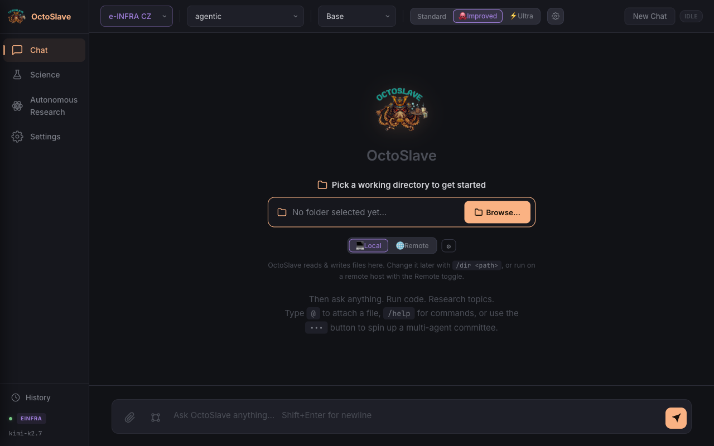

<div align="center">


<h1>OctoSlave</h1>
<a href="https://octoslave.karamazov.website">octoslave.karamazov.website</a>

<p><strong>Autonomous AI research &amp; coding assistant — powered by <a href="https://llm.ai.e-infra.cz">e-INFRA CZ</a>, <a href="https://build.nvidia.com">NVIDIA NIM</a>, or your own local GPU</strong></p>

[](https://www.python.org)
[](LICENSE)
[](https://llm.ai.e-infra.cz)
[](https://build.nvidia.com)
[](https://ollama.com)

</div>

---

OctoSlave is an autonomous agent for scientists and engineers. Give it a task or a research
topic — it explores the web, writes and runs code, debugs, evaluates, and iterates until the
job is done. It runs on cloud models (e-INFRA CZ / NVIDIA NIM / Any custom provider) or fully offline via Ollama.

**Modes**

- **Interactive agent** (`ots`) — chat-style assistant for whole projects or single tasks
- **One-shot** (`ots run "..."`) — run a task and exit, or stay interactive with `-i`
- **Parallel agents** (`--parallel N`) — N agents on one task; a Judge / vote / Merger picks the result
- **Autonomous Lab** (`/long-research`, or the web UI at `/lab`) — a Director assembles a custom team of specialists for your problem, a Critic vets the plan, and they research/build over multiple rounds with live human steering → self-contained HTML report

---

## Quick Overview

A visual walk-through of everything OctoSlave can do — capabilities, usage, model selection, and modes — rendered as a self-contained HTML report:

<div align="center">
<a href="docs/OctoSlave_Capabilities_Report.html">
  
</a>
</div>

[📖 View the full Capabilities Report](docs/OctoSlave_Capabilities_Report.html)

---

## Contents

- [Installation](#installation)
- [Quick start](#quick-start)
- [Highlights](#highlights)
- [Quick Overview](#quick-overview)
- [Commands](#commands)
- [Backends and models](#backends-and-models)
- [Modes in depth](#modes-in-depth)
- [MCP — custom tools](#mcp--custom-tools)
- [Tools](#tools)
- [Configuration](#configuration)
- [Documentation](#documentation)
- [License](#license)

---

## Installation

**Requirements:** Python 3.10+ and an [e-INFRA CZ](https://llm.ai.e-infra.cz) or
[NVIDIA NIM](https://build.nvidia.com) API key — *or* [Ollama](https://ollama.com) for fully local mode.

### Download installer — no Python required

Each package bundles Python and all dependencies, and launches a setup wizard on first run.

| Platform | Download |
|----------|----------|
| **macOS** | [OctoSlave-macOS.dmg](https://github.com/karatedava/octoslave/releases/latest/download/OctoSlave-macOS.dmg) |
| **Windows** | [OctoSlave-Windows-Installer.exe](https://github.com/karatedava/octoslave/releases/latest/download/OctoSlave-Windows-Installer.exe) |
| **Linux** | [OctoSlave-x86_64.AppImage](https://github.com/karatedava/octoslave/releases/latest/download/OctoSlave-x86_64.AppImage) |

### From source

```bash
# pipx (isolated, recommended)
pipx install "git+https://github.com/karatedava/octoslave.git#egg=octoslave[all]"

# pip / uv
git clone https://github.com/karatedava/octoslave.git && cd octoslave
pip install -e ".[all]"          # or: uv pip install -e ".[all]"

# one-shot installer (macOS / Linux) — picks Python, sets up pipx
bash scripts/install.sh
```

The Lab web UI ships **prebuilt** (in `octoslave/web/lab_static/`), so no Node.js is needed to
install or run. Only if you modify the frontend (`frontend/`) do you need to rebuild it:
`npm ci --prefix frontend && npm run build --prefix frontend` (Node 18+).

### Staying up to date

OctoSlave updates itself — no reinstalling when a new release lands.

- **Web UI** — an **Update to X** button appears in the sidebar. Click it for the
  release notes and a one-click install.
- **Terminal** — `ots update` (or `ots update --check` to only look).

It works out how you installed OctoSlave (pip, pipx, Homebrew, the `.dmg`,
`.exe` or `.AppImage`) and runs the right upgrade for it. The installer builds
replace themselves and reopen; Python installs just ask you to restart.

Checks hit the GitHub Releases API at most once every 6 hours and are cached.
Set `OCTOSLAVE_NO_UPDATE_CHECK=1` to switch them off entirely (air-gapped and
HPC deployments), or use **Skip this version** in the dialog to silence one release.

> Working from a git clone (`pip install -e .`)? That stays manual on purpose —
> `git pull && pip install -e ".[all]"`.

### Configure your API key

```bash
ots config                                # interactive wizard (einfra / nim / ollama)
ots config --api-key sk-YOUR_KEY          # e-INFRA CZ key
ots config --nim-api-key nvapi-YOUR_KEY   # NVIDIA NIM key
ots config --show                         # print current config (keys masked)
```

Config is saved at `~/.octoslave/config.json`; environment variables always take precedence
(`OCTOSLAVE_API_KEY`, `OCTOSLAVE_NIM_API_KEY`). See [docs/USAGE.md](docs/USAGE.md) for the full
install reference, including the optional [`codag`](https://codag.ai) helper that powers `compress_log`.

---

## Quick start

```bash
ots                                            # interactive TUI (default backend)
ots run "build a todo API"                     # one-shot task, then exit
ots improved                                   # Improved TUI — a unified model council (see below)
ots improved run "analyse this dataset"        # one-shot through the council
ots improved run "hard task" --ultra           # Ultra — multi-model debate (strongest)
ots --local                                    # local Ollama
ots --nim                                       # NVIDIA NIM
ots web                                          # browser UI at http://127.0.0.1:7860 (Standard · Improved · Ultra selector)
ots run "build a Flask REST API for a todo app"
ots run "summarise this paper" -i                # one-shot, then stay interactive

ots run "refactor the auth module" --parallel 3  # 3 agents, Judge picks the winner

# Autonomous Research — a self-organizing team. Open the web UI and go to /lab,
# or launch from the TUI:
ots
◆ /long-research "calibration methods for large language models" --rounds 3
```

### Three ways to work (web UI)

`ots web` opens a browser UI at `http://127.0.0.1:7860` with three tabs in the
sidebar, from lightest-touch to most autonomous:

| Tab | What it is | Reach for it when… |
|---|---|---|
| 💬 **Chat** | A single agent you converse with — it plans, edits files, runs tools, one task at a time. Optional Improved / Ultra council for harder problems. | Everyday coding & analysis, quick questions, or iterating on one thing with tight, turn-by-turn control. |
| 🧬 **Science** | A conversational **research orchestrator**. Chat-first, but it spins up specialists on demand, submits & polls HPC/cluster jobs, presents plots and tables **inline for comment-driven refinement**, curates messy data into **FAIR** datasets, and searches the literature. | Computational biology / data-heavy research where you want to stay in the loop and refine each output as it appears. |
| 🧪 **Autonomous Research** | A **self-organizing team** run as a batch pipeline: a Director assembles up to 10 specialists, a Critic gates the plan, the team implements & reviews over rounds, then writes a self-contained HTML report. Runtime tool/agent "foundry". | You want to hand off a whole problem and let a team run it end-to-end (fully autonomous or with step-mode approval gates), then read the report. |

All three share the same tools, models, and remote / MCP setup. Chat and
Autonomous Research also have TUI/CLI entry points; Science is web-only.
`http://127.0.0.1:7860/science` and `…/lab` open the Science and Autonomous
Research tabs directly.

---

## Highlights

| | |
|---|---|
| 🐙 **Improved mode** | A unified model council — Thinker · Worker · Verifier behind one agent (`ots improved`) |
| ⚡ **Ultra mode** | Deeper tier — a diverse panel debates the plan & completion, synthesized into one (`ots improved --ultra`) |
| 🔁 **Autonomous loop** | Runs many tool-call iterations end-to-end — no hand-holding |
| 🧠 **Upfront planning** | Writes a numbered execution plan before touching files |
| ✅ **Self-verification** | Optional DONE / PARTIAL / FAILED grade after each task (`--verify`) |
| 💾 **Project memory** | Prior outcomes & insights persisted per-project in `.octo/memory.md`, injected on the next run in that folder |
| 📦 **Smart compaction** | On overflow, oldest turns are summarised (not dropped); errors survive |
| 🐙 **Parallel agents** | N agents on one task; Judge / vote / Merger picks the winner |
| 🔬 **Autonomous Lab** | A Director builds a custom specialist team per task (≤10), revisable mid-run |
| 🛡️ **Critic gate** | A Critic challenges every plan before implementation — build only sound ideas |
| 🛠️ **Runtime expansion** | Agents build new tools, add teammates, or connect MCP servers mid-run |
| 🙋 **Human-in-the-loop** | Inject guidance live or let the team run fully autonomously; watch every agent |
| ⚡ **GPU-aware** | Hardware probe at startup; CUDA enforced in generated code |
| 🌐 **Web research** | DuckDuckGo search, full-page/PDF extraction, BFS website crawler |
| 🧬 **Bio & chem** | Direct REST access to UniProt, PubChem, ChEMBL, RCSB PDB, AlphaFold, GEO, ENA + RDKit |
| 🏠 **Local mode** | Full functionality via Ollama — no API key, complete privacy |

See [Modes in depth](#modes-in-depth) and the [docs](#documentation) for the rest.

---

## Commands

```bash
ots                              # interactive TUI
ots run TASK [options]           # one-shot task; -i to stay interactive afterwards
ots web [options]                # browser UI
ots config [options]             # setup wizard, or pass flags directly
ots models [--local]             # list available models
ots vault-improve PATH [options] # autonomous vault improvement
ots batch TASKS_FILE [options]   # run tasks one-per-line, with resume
ots update [--check]             # upgrade to the latest release in place

ots <command> --help             # full flag reference for any command
```

Common flags for `ots` and `ots run`:

| Flag | Description |
|------|-------------|
| `-m`, `--model` | Model override |
| `-d`, `--dir` | Working directory |
| `-p`, `--prompt-profile` | `base` / `coder` / `analyst` / `cryouncle` |
| `--local` / `--nim` | Force backend for this session |
| `--permission-mode` | `autonomous` / `controlled` / `supervised` |
| `--no-plan` / `--verify` / `--no-memory` | Toggle agentic behaviours |
| `--parallel N` / `--strategy` (run) | N agents on one task; `best` / `vote` / `merge` |
| `-i`, `-n` (run) | Stay interactive / create a fresh project directory |

### Slash commands (TUI & web)

| Command | Description |
|---------|-------------|
| `/help` | Show all commands |
| `/model [name]` | Switch model (lists available if no name) |
| `/dir [path]` · `/new-project [hint]` | Change or create a working directory |
| `/remote [id\|local\|add]` | Run tools locally or on a remote host over SSH |
| `/profile [name]` | Switch prompt profile |
| `/permission [mode]` | Show or change permission mode |
| `/plan` · `/verify` · `/memory` | Toggle agentic behaviours (`on`/`off`) |
| `/improved [on\|off\|status]` | Toggle Improved (council) mode and show the resolved roles |
| `/ultra [on\|off\|status]` | Toggle Ultra (multi-model debate) on top of Improved mode |
| `/parallel N [strategy] task` | Run N agents on one task |
| `/long-research TASK [flags]` | Launch the autonomous Lab (dynamic team) |
| `/vault-improve [path]` | Launch vault-wide note improvement |
| `/local` · `/einfra` · `/nim` | Switch backend |
| `/mcp …` | Manage MCP servers (see below) |
| `/compact` · `/clear` · `/undo` · `/share` | Session controls |

Type `@` at the prompt to autocomplete a file. `Ctrl+T` toggles permission mode, `Ctrl+C`
cancels generation, `Ctrl+D` exits. Run `/help` for the complete list.

---

## Backends and models

```
e-INFRA CZ access?  ──yes──▶ einfra   (best quality, free for Masaryk University)
NVIDIA NIM key?     ──yes──▶ nim      (good models, no local GPU needed)
GPU ≥8 GB VRAM?     ──yes──▶ ollama   (fully local, private, no API key)
otherwise           ──────▶ ollama on CPU (interactive tasks only)
```

Run `ots config` to choose, and `ots models` for the live list.

**e-INFRA CZ (default).** Recommended models:

| Goal | Model |
|------|-------|
| Best all-round — **start here** | `kimi-k2.7` |
| Chain-of-thought / hard problems | `deepseek-v3.2-thinking` |
| Code generation | `qwen3-coder-30b` |
| Writing-heavy tasks | `gpt-oss-120b` |

**NVIDIA NIM.** Cloud inference for frontier open-weight models via an OpenAI-compatible API.
Get a key at [build.nvidia.com](https://build.nvidia.com) (starts with `nvapi-`); default model
`nvidia/nemotron-3-super-120b-a12b`.

**Ollama (local).** `ollama serve`, `ollama pull llama3.1:8b`, then `ots --local`. All modes work
identically offline. 16 GB VRAM is a good starting point for research; CPU-only is fine for
interactive tasks.

Per-role model defaults for `/long-research` and full hardware recommendations are in
[docs/RESEARCH.md](docs/RESEARCH.md) and [docs/USAGE.md](docs/USAGE.md).

---

## Modes in depth

### Improved (council) mode

Instead of one model doing everything, a lightweight coordinator unifies a small pool of
**role-specialized** models behind a **single agent surface** — so a diverse pool beats any
single model.

```bash
ots improved                                   # Improved TUI (interactive)
ots improved run "analyse this dataset" -p analyst -d ~/data   # one-shot (mirrors `ots run`)
ots improved --ultra                           # deeper tier (multi-model debate)
ots improved --thinker glm-5.2                 # override a role
ots web                                         # web UI: Standard · Improved · Ultra selector (Improved default)
```

Three roles, drawn from the best of the e-INFRA offer:

| Role | Default | Job |
|------|---------|-----|
| 🔧 **Worker** | `kimi-k2.7` | Drives the tool loop — reads, writes, runs commands |
| 🧠 **Thinker** | `kimi-k2.7` | Orients, writes the plan, course-corrects when the Worker stalls |
| 🔍 **Verifier** | `glm-5.2` | Independent critic — reviews risky actions *before* they run and gates completion |

A **heuristic coordinator** routes each step (no extra routing call, so it stays fast):

- read-only steps run on the Worker alone;
- **mutating** actions (`write_file` / `edit_file` / `apply_patch` / `bash` / `run_background`)
  are reviewed by the Verifier *before* execution — on `REVISE`, the Worker fixes and retries;
- repeated errors pull in the Thinker for a course correction;
- when the Worker claims done, the Verifier grades the result and can send it back for another round.

**Diversity escalation:** when the Worker gets stuck — repeated errors, a verifier-deadlocked action,
a rejected completion, or **re-running the same action with no progress** — the loop switches it to a
different model *family* (a block one family can't clear is often trivial for another) and, on a
rejected completion, the Thinker re-strategizes. Two trust guards: the Worker is **forced to act
before it can ever "complete"**, and a run that loops on an identical action is stopped automatically.

**⚡ Ultra** (`ots improved --ultra`, `/ultra on`, or the web selector): for the hardest tasks, a
**diverse panel** (one model per family, e.g. `kimi-k2.7 · glm-5.2 · deepseek-v3.2-thinking`) each
drafts the **plan** in isolation and the aggregator synthesizes one stronger plan; at **completion**
the panel independently grades the work and the aggregator resolves their verdicts. Isolated
drafts/reviews preserve diversity; the synthesis harvests their combined strengths — how a
non-frontier pool can exceed any single model. More tokens/latency, so it's **off by default**.

Models are **probed live** at startup and resolved down a fallback chain; override any role with
`--worker/--thinker/--verifier` or `OCTOSLAVE_COUNCIL_{WORKER,THINKER,VERIFIER}`. Toggle mid-session
with `/improved on|off|status` and `/ultra on|off|status`. Needs a cloud backend (e-INFRA / NIM); on
local Ollama it falls back to the normal single agent. The plain `ots` is unchanged. Full details:
[docs/IMPROVED_MODE.md](docs/IMPROVED_MODE.md).

### Agentic behaviour

OctoSlave is deliberate by design: it **plans** before acting, can **verify** its own work,
keeps **per-project memory**, **nudges itself** out of repeated failures, and **compacts
context** automatically so long runs survive overflow.

| Flag | Default | Effect |
|------|---------|--------|
| `--no-plan` | plan ON | Skip the upfront execution plan |
| `--verify` | verify OFF | Grade completion (DONE / PARTIAL / FAILED) after the task |
| `--no-memory` | memory ON | Don't load or save the project's `.octo/memory.md` |

TUI toggles: `/plan`, `/verify`, `/memory` (`on`/`off`), `/show-plan`, `/compact`.

### Parallel agents

```bash
ots run "refactor auth.py" --parallel 3 --strategy best   # judge picks the best
ots run "write a benchmark"  --parallel 4 --strategy vote   # peers vote, majority wins
ots run "compare A vs B"     --parallel 3 --strategy merge  # synthesised → PARALLEL_MERGE.md
```

Each agent runs in an isolated copy of the working directory under `.parallel/run_{i}/`; the
winner's files are promoted back. Diversity comes from rotating prompt profiles.

### Autonomous Research (the Lab)

Autonomous Research (served at `/lab`) is a **dynamic, self-organizing research team** (inspired by Stanford's Virtual Lab).
Instead of a fixed role list, a **Director** agent reads your task and assembles a custom team of
up to **10 specialists** tailored to the problem — biology, ML, finance, writing, software,
anything. The flow each run:

1. **Assemble** — the Director designs the team (each specialist gets a role, expertise, goal, and
   a curated tool set).
2. **Plan** — a team meeting debates the approach; a **Critic** challenges it before any work
   starts (approve / revise / reject).
3. **Implement** — specialists work in individual meetings, producing real, organized outputs.
4. **Review** — the team reviews progress; the Director decides to iterate, reshape the team, or
   report.
5. **Report** — a self-contained HTML report is written.

**Runtime self-expansion (the tool foundry):** when an agent hits a wall, it can `request_tool`
(a new Python tool is written, validated, and registered — callable immediately), `request_agent`
(add a teammate), or `request_mcp` (connect a known MCP server) — all mid-run.

**Human-in-the-loop:** run fully autonomous, or step mode (the Lab pauses at gates for your
approval). Either way you can inject guidance at any moment from the web UI, which the team folds
into its next agenda.

```
/long-research TASK [--rounds N] [--all MODEL] [--resume]      # TUI
ots web   →   http://127.0.0.1:7860/lab                         # web UI (recommended)
```

Everything is persisted under `<working_dir>/lab/`: `state.json`, live `plan.md` and `team.md`,
meeting transcripts in `meetings/`, organized work in `projects/<subproject>/`, any
runtime-built tools in `tools/`, and the final `report.html`. All roles run on `kimi-k2.7` by
default. Full contract: [docs/RESEARCH.md](docs/RESEARCH.md).

### Science — a conversational research orchestrator

Where the Lab runs a team as a batch pipeline, **Science** (web UI tab at `/science`) is
**chat-first**: an orchestrator agent works *with* you turn by turn. It's built for computational
biology and data-heavy research:

- **Spins up specialists on demand** — like the Lab's Director, but interactively: it delegates a
  bounded sub-task to a focused agent (Structural Biologist, Data Wrangler, …) and folds the result
  back into the conversation.
- **Presents outputs inline** — every plot, table, report, or dataset it produces appears as a card
  in the chat. **Comment on it to refine** (the orchestrator regenerates that specific output), or
  **edit** text/CSV/markdown outputs in place.
- **Biology & chemistry tools** — the full domain toolbox (`bio_inspect`, `rdkit_describe`,
  UniProt / PubChem / ChEMBL / PDB / AlphaFold / GEO / ENA lookups, `pdf_ocr`); connect an NVIDIA
  BioNeMo model as an MCP server to call it as a tool.
- **Cluster jobs** — offloads long computation to a remote HPC scheduler (Slurm/PBS) or a detached
  background process, and polls it, so the conversation never blocks.
- **FAIR & reproducible** — curates messy research data into documented datasets
  (`datapackage.json`) and logs how every result was made to `science/PROVENANCE.md`.
- **Knowledge search** — finds the most relevant current literature (Europe PMC) before committing
  to an approach.

```
ots web   →   http://127.0.0.1:7860/science
```

State persists under `<working_dir>/science/` (`state.json`, `PROVENANCE.md`, job logs) so a
session can be reopened and continued.

### Vault improve & batch

```bash
ots vault-improve ~/Brain --profile base --resume   # note-by-note vault improvement
ots batch tasks.txt --resume                             # tasks one-per-line, '#' = comment
```

Both persist state to disk and resume exactly where they left off. See
[docs/VAULT_IMPROVE.md](docs/VAULT_IMPROVE.md).

### Remote execution (SSH)

By default the agent operates on your local machine. Switch to a **remote host**
and its `bash` and file tools (read / write / edit, glob, grep, list, background
jobs) run over SSH on that host instead — for remote compute, GPUs, or data that
lives on a server. Path-based bio/OCR tools still work: the remote file is staged
to a local temp copy, processed, and any output pushed back. **Local is always the
default**; you opt in per session, and switching back is instant.

**Add a host once**, then switch between hosts freely — the toggle/`/remote`
command lists every configured remote so you can pick which one to connect to.

```bash
# TUI
ots
  /remote add            # register a host (id, name, host, user, port, optional key)
  /remote list           # show every configured remote
  /remote <id>           # connect to one over SSH (starts in its home dir)
  /remote local          # back to local execution
  /dir <path>            # change the remote folder

# One-shot
ots run "train the model" --remote gpu01
```

**Web UI.** Next to the working-directory picker there's a **💻 Local | 🌐 Remote**
toggle (a dropdown lets you choose *which* remote when several are configured).
Choosing *Remote* with nothing set up opens the **Remote hosts (SSH)** card in
Settings — add / test connection / delete. Once connected you start in the remote
home directory, and the **Browse…** button navigates folders **on the remote host**
(no working directory is entered up front). The toggle is on the start screen and
after every **New Chat**.

**Too lazy to configure?** Ask OctoSlave to do it: in local mode, tell it e.g.
*"add a remote host for yourself — host gpu.example.org, user me, id gpu01: verify
key-based SSH works, append it to the `remotes` list in `~/.octoslave/config.json`,
and test the connection"*. The config is re-read on every request, so the new host
appears in the 🌐 Remote dropdown immediately. (The only thing it can't do is type
your password — if key auth is missing it hands you the `ssh-copy-id` command.)

**Transport & auth.** OctoSlave shells out to your system `ssh`/`scp`, so it honors
`~/.ssh/config`, keys, ssh-agent and `ProxyJump`, with connection multiplexing for
speed. Auth is **key/agent based** (no interactive password prompts), so a
passphrase-protected key must be loaded once with `ssh-add` first. Remotes are
stored in `~/.octoslave/config.json`; MCP servers stay local.

See [docs/REMOTE_EXECUTION.md](docs/REMOTE_EXECUTION.md) for the full guide.

---

## MCP — custom tools

OctoSlave speaks the [Model Context Protocol](https://modelcontextprotocol.io), so you can plug
in external tools (git, GitHub, a real browser, databases, your own scripts) and the agent uses
them alongside the built-in ones — everywhere, including the research pipeline and web UI. The
MCP client is **built in** (no extra dependency) and supports both **stdio** and **http** transports.
Each tool is exposed as `mcp__<server>__<tool>`.

**Web UI.** Open **Settings → MCP Tools**. The **Catalog** lists ~21 curated servers
(Filesystem, Git, GitHub, Playwright browser, search, SQLite/Postgres, Slack, Notion, …) —
click **install**, fill in the one or two things that are yours (a folder, a token), done.
**+ Add a custom server** covers anything else (stdio command or http URL + headers), and
**Your servers** shows live status, tool counts and per-server enable/remove.

```bash
# TUI
/mcp                       # list servers + live status
/mcp registry              # browse the curated catalog (21 servers)
/mcp install filesystem    # install a catalog server (prompts for inputs)
/mcp add NAME CMD [args…]   # quick-add a custom stdio server
/mcp reconnect              # re-read config and reconnect
```

**Too lazy to configure?** Ask OctoSlave to wire in its own tools: e.g. *"add the Playwright
browser MCP server to your toolbox — look its command up in your built-in catalog
(`octoslave.mcp_registry`), append the entry to `mcp_servers` in `~/.octoslave/config.json`,
and check the runtime (npx/uvx) exists"*. Then one click on **Reconnect all** (or
`/mcp reconnect`) picks it up — the config is re-read on reconnect, no restart.

Servers are persisted in `~/.octoslave/config.json` under `mcp_servers`; anything added via the
TUI or web Settings tab is shared between them. In `controlled` mode, MCP calls require
confirmation; a server that fails to start is reported and skipped without blocking the rest.

See [docs/MCP.md](docs/MCP.md) for the full guide (catalog, custom servers, schema,
troubleshooting).

---

## Tools

**Filesystem & shell** — `read_file`, `write_file`, `edit_file`, `apply_patch`, `bash`, `glob`,
`grep`, `list_dir`

**Process & workflow** — `run_background`, `check_process`, `stop_process`, `todo_write`,
`ask_user`, `compress_log` (drops noisy logs into a templated summary via [codag](https://codag.ai))

**Web** — `web_search`, `web_fetch`, `crawl_tree` (BFS website crawler, Playwright-aware)

**Images** — `view_image` shows the model the actual pixels, so it can read a plot's shape,
inspect a structure or micrograph, or judge a screenshot; `image_ocr` extracts text and exact
printed numbers with tesseract. Use both on one figure when you need the shape *and* the values.
`view_image` only fires on a model that can really see: octoslave checks the `model_vision`
config override, then the endpoint's advertised capability, then a one-off live probe that makes
the model name two random colours — measured against e-INFRA, a text-only model accepts an image
with a clean `200` and silently ignores it, so "the request worked" proves nothing. On a
text-only model the tool refuses and says so rather than letting the model narrate a picture it
never saw. Large images are downscaled to 1280 px (needs Pillow; smaller PNG/JPEG/GIF/WEBP files
are sent as-is without it), and only the newest few stay in context.

**Lab runtime expansion** *(active only inside the Autonomous Lab)* — `request_tool` (build &
register a new Python tool at runtime), `request_agent` (add a specialist to the team),
`request_mcp` (connect a registry MCP server). These are off in single-agent / chat mode.

**Biology & chemistry** *(install with `pip install -e ".[bio]"`)* — `bio_inspect`,
`rdkit_describe`, `uniprot_lookup`, `pubchem_lookup`, `chembl_lookup`, `pdb_fetch`,
`alphafold_fetch`, `geo_search`, `ena_fetch`, `pdf_ocr`. These call public REST APIs directly
and are preferred over `web_fetch` for any such lookup.

---

## Configuration

Precedence: **environment variable** → `~/.octoslave/config.json` → built-in default.

| Variable | Description |
|----------|-------------|
| `OCTOSLAVE_API_KEY` / `OCTOSLAVE_BASE_URL` | e-INFRA CZ key / base URL |
| `OCTOSLAVE_NIM_API_KEY` / `OCTOSLAVE_NIM_URL` | NVIDIA NIM key / base URL |
| `OCTOSLAVE_OLLAMA_URL` | Ollama base URL (default `http://localhost:11434/v1`) |
| `OCTOSLAVE_MODEL` / `OCTOSLAVE_BACKEND` | Default model / backend (`einfra` / `ollama` / `nim`) |
| `OCTOSLAVE_PERMISSION_MODE` | `autonomous` / `controlled` / `supervised` |
| `OCTOSLAVE_CONSTITUTION` | Constitution layer: `1`/`0` (default on; config key `constitution`) |
| `OCTOSLAVE_MAX_LIVE_IMAGES` | How many viewed images stay in context (default 3; older ones become a stub) |
| `OCTOSLAVE_VISION_PROBE_TIMEOUT` | Seconds to wait for the one-off vision capability probe (default 75) |

**Vision override:** `"model_vision": {"my-model": true}` in `~/.octoslave/config.json` forces
`view_image` on or off for a model whose capability is detected wrongly.

**Permission modes:** `autonomous` (default, no prompts), `controlled` (ask before any
modifying action), `supervised` (ask before file edits only). See
[docs/PERMISSION_MODE.md](docs/PERMISSION_MODE.md).

**Constitution:** a compact character/values layer prepended to the system prompt of
every profile — the agent stays honest and calibrated, reads intent over literal
wording, and is warmer to work with. On by default; disable with
`OCTOSLAVE_CONSTITUTION=0` or `"constitution": false` in `~/.octoslave/config.json`.

**Prompt profiles:** `base` (default), `coder`, `analyst`, and `cryouncle` (a
CryoSPARC-connected cryo-EM companion for structural biologists). Switch with
`-p NAME` or `/profile NAME`. See [docs/PROMPT_PROFILES.md](docs/PROMPT_PROFILES.md).

---

## Documentation

| Doc | Contents |
|-----|----------|
| [docs/OctoSlave_Capabilities_Report.html](docs/OctoSlave_Capabilities_Report.html) | Visual advertisement report — capabilities, usage, model selection, modes |
| [docs/IMPROVED_MODE.md](docs/IMPROVED_MODE.md) | Improved (council) mode — roles, coordinator, config |
| [docs/USAGE.md](docs/USAGE.md) | Extended usage examples and install reference |
| [docs/RESEARCH.md](docs/RESEARCH.md) | Long-research pipeline contract and per-role models |
| [docs/VAULT_IMPROVE.md](docs/VAULT_IMPROVE.md) | Vault-improve pipeline |
| [docs/REMOTE_EXECUTION.md](docs/REMOTE_EXECUTION.md) | Run the agent on a remote host over SSH |
| [docs/MCP.md](docs/MCP.md) | Connect external tools via MCP (catalog, custom servers, lazy setup) |
| [docs/PERMISSION_MODE.md](docs/PERMISSION_MODE.md) | Permission mode reference |
| [docs/PROMPT_PROFILES.md](docs/PROMPT_PROFILES.md) | Prompt profile reference |
| [docs/SCRAPING.md](docs/SCRAPING.md) | Web scraping / `crawl_tree` details |
| [docs/DEPLOYMENT.md](docs/DEPLOYMENT.md) | Deployment guide |

---

## License

MIT — see [LICENSE](LICENSE).

<div align="center">
<br/>

<br/>
<sub>Built for researchers who demand real results.</sub>
</div>
